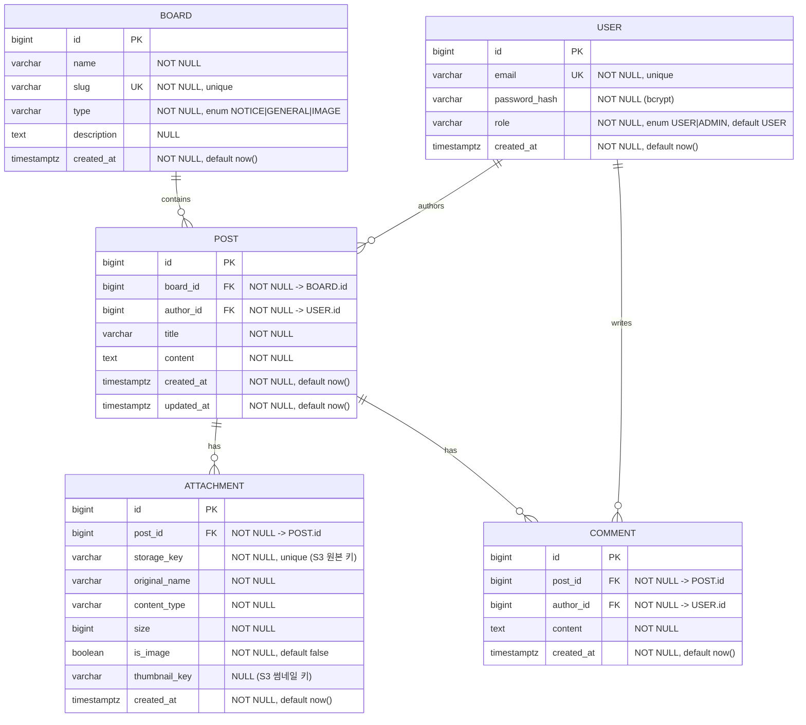

# DB 스키마 정의서 (Database Schema Definition)

영속 저장소는 PostgreSQL 16. 마이그레이션은 Alembic으로 버전 관리한다.

## 제약·인덱스

- `USER.email` UNIQUE, `BOARD.slug` UNIQUE, `ATTACHMENT.storage_key` UNIQUE.
- 인덱스: `POST(board_id, created_at DESC)` — 게시판 목록 페이지네이션. `COMMENT(post_id, created_at)`, `ATTACHMENT(post_id)`.
- FK는 `ON DELETE CASCADE`(POST 삭제 시 ATTACHMENT/COMMENT 정리). S3 객체 삭제는 애플리케이션 레벨에서 처리.
- enum은 PostgreSQL enum 타입 또는 CHECK 제약으로 강제(ADR-0002 참조).

## 마이그레이션/버전 전략

- Alembic. 각 phase에서 스키마 변경은 마이그레이션 파일로 추가(되돌릴 수 있게 `upgrade`/`downgrade` 작성).
- 초기 ADMIN 계정은 시드 마이그레이션 또는 별도 시드 스크립트로 생성(비밀번호는 env 주입, 평문 커밋 금지).
