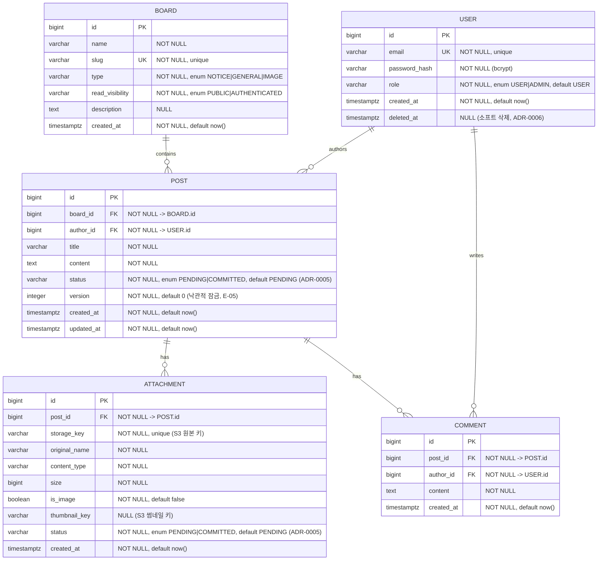

# DB 스키마 정의서 (Database Schema Definition)

영속 저장소는 PostgreSQL 16. 마이그레이션은 Alembic으로 버전 관리한다.

## 제약·인덱스

- UNIQUE: `BOARD.slug`, `ATTACHMENT.storage_key`, **`ATTACHMENT.thumbnail_key`(부분 유니크 — `WHERE thumbnail_key IS NOT NULL`)** (A-05).
  - **`USER.email`(NV2-003)**: 활성 사용자에 대해서만 유니크 — **부분 유니크 `WHERE deleted_at IS NULL`**. 소프트 삭제 시 service가 email을 비식별화(예: `deleted+{id}@…`)하여 동일 이메일 재가입을 허용한다.
- 인덱스: `POST(board_id, status, created_at DESC)` — 목록은 `status='COMMITTED'`만 노출하므로 status 포함(E-06 커서 페이지네이션). `COMMENT(post_id, created_at)`, `ATTACHMENT(post_id)`.
- **상태 컬럼(ADR-0005, NV2-001)**: `POST.status`/`ATTACHMENT.status`는 PENDING→COMMITTED. 사용자에게는 `COMMITTED`만 서빙. 조정 잡이 threshold 초과 PENDING 회수.
- **FK별 삭제 동작(A-04) + S3 삭제 순서(NV2-002)** — 일괄 CASCADE 금지:
  - `POST.author_id → USER`: `ON DELETE RESTRICT` (사용자 소프트 삭제, 콘텐츠 보존 — ADR-0006).
  - `COMMENT.author_id → USER`: `ON DELETE RESTRICT`.
  - `POST.board_id → BOARD`: `ON DELETE RESTRICT` (게시판 삭제는 애플리케이션이 하위 정리 후 수행, E-03).
  - `COMMENT.post_id → POST`: `ON DELETE CASCADE`.
  - **`ATTACHMENT.post_id → POST`: `ON DELETE RESTRICT`(NV2-002)** — DB CASCADE가 S3 삭제보다 먼저 일어나 orphan을 만들지 않도록, **삭제 순서를 애플리케이션이 강제**한다: ① S3 객체 삭제 → ② Attachment 행 삭제 → ③ Post 행 삭제(단일 트랜잭션 경계). 실패분은 조정 잡이 회수(E-02).
- enum은 PostgreSQL enum 타입 또는 CHECK 제약으로 강제(ADR-0002 참조).
- `BOARD.read_visibility`(E-04): ADMIN이 게시판 생성 시 지정. `PUBLIC`=비인증 포함 읽기, `AUTHENTICATED`=인증 사용자만 읽기.
- `POST.version`(E-05): 수정 시 낙관적 잠금. 클라이언트가 보유 version과 불일치하면 409 Conflict.

## 마이그레이션/버전 전략

- Alembic. 각 phase에서 스키마 변경은 마이그레이션 파일로 추가(되돌릴 수 있게 `upgrade`/`downgrade` 작성). expand/contract 안전 규칙은 deployment.md(P-04) 참조.

## 관리자 라이프사이클 (Y-02)

- **초기 ADMIN**: 시드 스크립트로 생성(비밀번호는 env 주입, 평문 커밋 금지).
- **승격**: 기존 ADMIN이 다른 USER를 ADMIN으로 승격하는 관리 엔드포인트(ADMIN only).
- **비밀번호 재설정/복구**: MVP는 ADMIN이 사용자 비밀번호를 재설정하는 수동 경로(이메일 발송은 범위 밖). 최후의 ADMIN 복구는 시드 스크립트 재실행으로 처리(운영 절차로 문서화).
