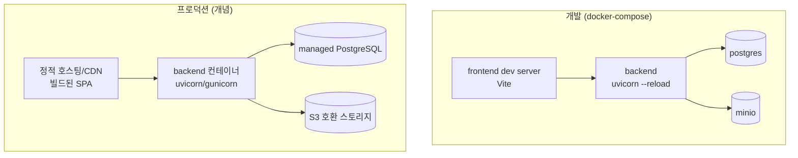

# 배포 아키텍처 (Deployment Architecture)

## 런타임 토폴로지

## 환경 (Environments)

| 환경 | 용도 | 데이터 |
| --- | --- | --- |
| dev | 로컬 개발, docker-compose | 임시/시드 |
| staging | 통합 검증 | prod 유사 |
| prod | 운영 | 실데이터 |

- 환경별 설정은 환경변수로 주입(`.env`는 dev 한정, prod는 시크릿 매니저).

## CI/CD

- CI: lint(`ruff`+`mypy` / `npm run lint`) → test → coverage 게이트(§3.3, 신규 코드 80%).
- 마이그레이션: 배포 파이프라인에서 Alembic `upgrade head`.
- 롤백: 애플리케이션은 이전 이미지로 롤백, DB는 Alembic `downgrade` 또는 백업 복구. 마이그레이션은 가급적 backward-compatible(확장 우선).

## 빌드 산출물

- frontend: 정적 번들(CDN/정적 호스팅).
- backend: 컨테이너 이미지(uvicorn/gunicorn).
