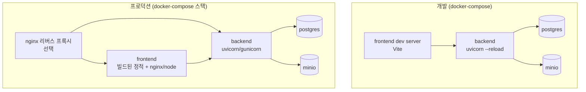

# 배포 아키텍처 (Deployment Architecture)

## 런타임 토폴로지

## 환경 (Environments)

| 환경 | 용도 | 데이터 | 실행 방식 |
| --- | --- | --- | --- |
| dev | 로컬 개발 | 임시/시드 | 동일 compose 파일 + `.env.dev` |
| staging | 통합 검증 | prod 유사 | 동일 compose 파일 + `.env.staging` |
| prod | 운영 | 실데이터 | 동일 compose 파일 + `.env.prod` |

- dev/staging/prod 모두 **동일한 docker-compose 파일**을 사용하고, 환경별 차이는 `.env` 오버라이드(`.env.dev`/`.env.staging`/`.env.prod`)로 주입.
- 시크릿은 `.env`에 평문 저장하지 않고 환경별 시크릿 주입 경로를 사용.

## CI/CD

- CI: lint(`ruff`+`mypy` / `npm run lint`) → test → coverage 게이트(§3.3, 신규 코드 80%).
- 배포: 환경별 `.env` 오버라이드와 함께 동일 compose 파일로 `docker compose up`.
- ⚠️ CI/CD 파이프라인 설정 변경은 AGENTS.md §4 보호 대상 → 사람 승인 필요(P-03).

### 마이그레이션 안전성 (단계별, P-04)

- **expand/contract 패턴**: backward-compatible 한 Alembic 마이그레이션을 단계로 분리(먼저 확장(expand)으로 신구 코드 동시 호환 → 배포 안정화 후 contract로 정리).
- **마이그레이션 전 백업**: `upgrade head` 직전에 postgres 백업(dump) 생성.
- **downgrade 검증**: 각 마이그레이션의 `downgrade` 경로를 사전에 테스트하여 롤백 가능 보장.
- **복구 검증(restore verification)**: 백업본으로부터의 복구를 실제로 테스트해 데이터 무결성 확인.
- 롤백: 애플리케이션은 이전 이미지로 롤백, DB는 검증된 Alembic `downgrade` 또는 백업 복구.

## 빌드 산출물

- frontend: 빌드된 정적 번들을 컨테이너(nginx 또는 node 서버)에서 서빙.
- backend: 컨테이너 이미지(uvicorn/gunicorn).
- 데이터 계층: postgres, minio 컨테이너. 선택적으로 nginx 리버스 프록시 컨테이너.
