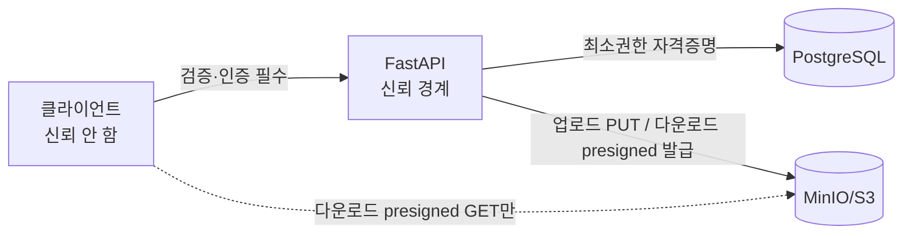

# 보안 아키텍처 (Security Architecture)

> v2: codex 교차 검증(S-01~S-06, E-01/E-03/E-04, A-04) 반영.

## 인증 (Authentication)

- email + password. 비밀번호는 **bcrypt**(cost ≥ 12) 해시로만 저장, 평문 미저장.
- 로그인 성공 시 **JWT access token** 발급(`sub`=user_id, `role`, `exp`). 무상태.
- **토큰 정책(S-02)**:
  - access token TTL = **30분**. refresh token은 MVP **범위 밖**으로 명시(만료 시 재로그인).
  - 로그아웃 = 클라이언트 토큰 폐기(무상태이므로 서버 세션 없음). 강제 폐기가 필요한 사고 대응은 **JWT secret 회전**으로 전체 무효화(운영 절차로 문서화).
  - `iat`/`exp` 검증, 서명 알고리즘 고정(HS256, alg confusion 방지).
- **토큰 저장(S-01)**: 클라이언트는 **메모리 보관(in-memory)**, localStorage/sessionStorage 사용 금지(XSS 탈취 방지). 탭 새로고침 시 재로그인(MVP 트레이드오프).
- **로그인 남용 방어(S-05)**: IP+계정 기준 rate limit, 인증 실패는 **일반화된 메시지**(계정 열거 방지), 인증 이벤트 감사 로그.

## 인가 (Authorization)

FastAPI 의존성으로 **service 계층**에서 집행한다. 토큰의 role을 신뢰하지 않고 서버가 재확인한다.

### 읽기 가시성 (E-04, Board.read_visibility)

게시판 생성 시 ADMIN이 `read_visibility`를 지정한다:
- **PUBLIC**: 비인증 사용자 포함 누구나 읽기.
- **AUTHENTICATED**: 인증 사용자만 읽기.

쓰기 권한은 `Board.type`으로 분기(아래). 읽기는 `read_visibility`로 분기 — 두 축은 독립.

| 동작 | 규칙 |
| --- | --- |
| 게시판 생성/삭제 | ADMIN only |
| 게시판 읽기 | `read_visibility`=PUBLIC → 전체 / =AUTHENTICATED → 인증 사용자 |
| NOTICE 글쓰기 | ADMIN only |
| GENERAL/IMAGE 글쓰기 | 인증 사용자 |
| 게시물/댓글 수정·삭제 | 작성자 본인 또는 ADMIN |
| 첨부 업로드 | 게시판 쓰기 권한에 종속(백엔드 경유, A-02) |
| 첨부 다운로드 | 게시판 읽기 권한(`read_visibility`) 검사 후 presigned GET 발급 |

> NOTICE도 `read_visibility`로 읽기 가시성을 정한다(예: 공지=PUBLIC 권장이나 ADMIN이 선택). 쓰기만 ADMIN 고정.

### IMAGE 게시판 불변식 (E-01)

"이미지 1개 이상" 규칙은 **생성·수정·첨부 삭제 전 구간**에서 강제한다:
- 게시물 생성: 이미지 0개면 422.
- 첨부(이미지) 삭제: 삭제 후 이미지가 0개가 되면 거부(마지막 이미지 삭제 불가).
- 게시물 수정: 이미지가 0개로 떨어지는 변경 거부.
- 게시판 type 변경은 MVP 범위 밖(불변).

## 파일 업로드 검증 (S-03)

업로드는 **백엔드 경유**(A-02). service가 다음을 검증:
- **매직바이트(content sniffing)** 로 실제 타입 확인 + 확장자 + Content-Type 교차 검증.
- 허용 MIME 매트릭스(이미지 게시판: image/jpeg, image/png, image/webp 등 화이트리스트).
- 크기 상한(예: 이미지 10MB, 일반 첨부 25MB — 운영값은 설정).
- 이미지: **Pillow 디코딩 검증 + 재인코딩**(악성 페이로드 무력화), 픽셀 치수 상한, **압축 폭탄(decompression bomb) 방어**(`Image.MAX_IMAGE_PIXELS`).
- 업로드 파일명은 서버 생성 `storage_key`로 대체(경로 조작·덮어쓰기 방지).

## 출력 인코딩 / XSS (S-04)

- 게시글 제목·본문·댓글·파일명은 사용자 입력 → **프론트엔드 출력 시 이스케이프**(React 기본 이스케이프 의존, `dangerouslySetInnerHTML` 금지).
- 리치텍스트는 MVP 범위 밖(plain text + 개행만). 도입 시 서버 sanitize(allowlist) 필수.
- **CSP** 헤더 적용(script-src self, S3 도메인은 img-src/connect-src 한정).

## Presigned URL 수명주기 (S-06)

- **다운로드 전용** GET(업로드는 백엔드 경유, A-02).
- TTL = **5분**(단기). 메서드는 GET으로 바인딩, **오브젝트 키 바인딩**(특정 키만).
- 버킷은 퍼블릭 금지. URL은 발급 시 권한 검사 통과 후에만.
- 로그에 presigned URL 전체를 남기지 않는다.

## 신뢰 경계 (Trust Boundaries)

## 민감 데이터·시크릿

- JWT secret, DB/MinIO 자격증명은 `.env`(커밋 금지, AGENTS.md §4 보호 대상).
- 로그에 비밀번호·토큰·presigned URL 전체를 남기지 않는다.

## 위협 모델 요약 (STRIDE 경량)

| 위협 | 대응 |
| --- | --- |
| 권한 상승(USER가 ADMIN 동작) | service 계층 role 게이트, 토큰 role 서버 재확인 |
| 토큰 탈취(XSS) | 메모리 보관(S-01), CSP·출력 이스케이프(S-04), 짧은 TTL(S-02) |
| 비인가 읽기/첨부 접근 | read_visibility 검사 후 presigned 발급(E-04, S-06) |
| 악성 파일 업로드 | 매직바이트·재인코딩·압축폭탄 방어(S-03), 실행권한 없는 스토리지 |
| 로그인 남용/계정 열거 | rate limit, 일반화 오류, 감사 로그(S-05) |
| 인젝션 | ORM 파라미터 바인딩, raw SQL 지양 |
| 자격증명 유출 | 시크릿 env 분리, bcrypt 해시 |
| 데이터 정합성(DB-S3) | 업로드 트랜잭션 프로토콜·보상 잡(A-03, E-02) |
