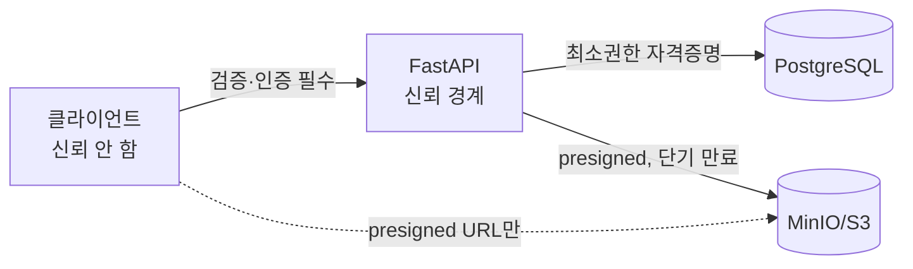

# 보안 아키텍처 (Security Architecture)

## 인증 (Authentication)

- email + password. 비밀번호는 **bcrypt**(cost ≥ 12) 해시로만 저장, 평문 미저장.
- 로그인 성공 시 **JWT access token** 발급(`sub`=user_id, `role`, 짧은 만료). 무상태.
- (향후) refresh token / 만료 회전은 별도 phase. 현 범위는 access token.

## 인가 (Authorization)

FastAPI 의존성으로 service 계층에서 집행한다.

| 동작 | 규칙 |
| --- | --- |
| 게시판 생성/삭제 | ADMIN only |
| NOTICE 글쓰기 | ADMIN only |
| NOTICE 읽기 | 전체 |
| GENERAL/IMAGE 읽기·쓰기 | 인증 사용자 |
| 게시물/댓글 수정·삭제 | 작성자 본인 또는 ADMIN |
| 첨부 업로드/다운로드 | 해당 게시판 쓰기/읽기 권한에 종속 |

## 신뢰 경계 (Trust Boundaries)

- 모든 입력은 pydantic 스키마로 검증. 파일은 **MIME 화이트리스트 + 확장자 + 크기 상한** 검증, 이미지 게시판은 이미지 타입만 허용.
- S3 직접 접근은 **presigned URL**(단기 만료)로만. 버킷은 퍼블릭 금지.
- 업로드 파일명은 서버가 생성한 `storage_key`로 대체(경로 조작·덮어쓰기 방지).

## 민감 데이터·시크릿

- JWT secret, DB/MinIO 자격증명은 `.env`(커밋 금지, AGENTS.md §4 보호 대상).
- 로그에 비밀번호·토큰·presigned URL 전체를 남기지 않는다.

## 위협 모델 요약 (STRIDE 경량)

| 위협 | 대응 |
| --- | --- |
| 권한 상승(USER가 ADMIN 동작) | service 계층 role 게이트, 토큰 role 신뢰 안 함→서버 재확인 |
| 비인가 첨부 접근 | presigned 단기 URL, 게시판 권한 검사 후 발급 |
| 악성 파일 업로드 | MIME/크기 검증, 이미지 재인코딩(Pillow), 실행 권한 없는 스토리지 |
| 인젝션 | ORM 파라미터 바인딩, raw SQL 지양 |
| 자격증명 유출 | 시크릿 env 분리, bcrypt 해시 |
