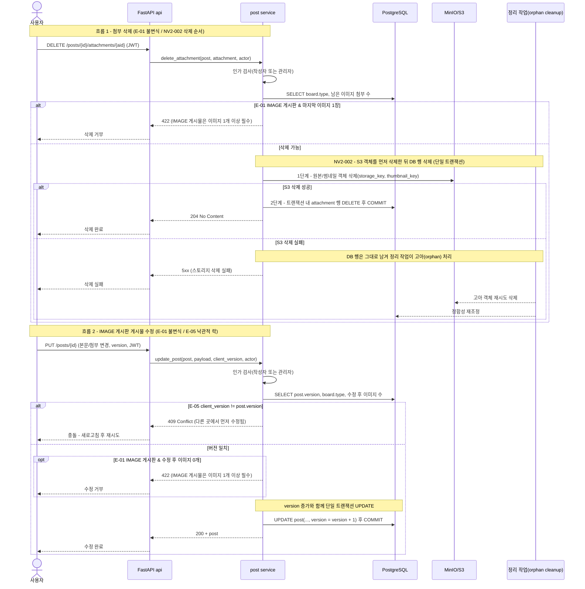

# 시퀀스: 첨부 삭제 + 이미지 게시판 불변식 (E-01 / NV2-002)

첨부 삭제 시 IMAGE 게시판의 "이미지 1개 이상" 불변식(E-01)과 S3→DB 삭제 순서(NV2-002), 그리고 IMAGE 게시판 게시물 수정 시 낙관적 락(E-05)을 다룬다.

```mermaid
sequenceDiagram
  actor U as 사용자
  participant API as FastAPI api
  participant SVC as post service
  participant DB as PostgreSQL
  participant S3 as MinIO/S3
  participant JOB as 정리 작업(orphan cleanup)

  Note over U,SVC: 흐름 1 - 첨부 삭제 (E-01 불변식 / NV2-002 삭제 순서)
  U->>API: DELETE /posts/{id}/attachments/{aid} (JWT)
  API->>SVC: delete_attachment(post, attachment, actor)
  SVC->>SVC: 인가 검사(작성자 또는 관리자)
  SVC->>DB: SELECT board.type, 남은 이미지 첨부 수
  alt E-01 IMAGE 게시판 & 마지막 이미지 1장
    SVC-->>API: 422 (IMAGE 게시물은 이미지 1개 이상 필수)
    API-->>U: 삭제 거부
  else 삭제 가능
    Note over SVC,JOB: NV2-002 - S3 객체를 먼저 삭제한 뒤 DB 행 삭제 (단일 트랜잭션)
    SVC->>S3: 1단계 - 원본/썸네일 객체 삭제(storage_key, thumbnail_key)
    alt S3 삭제 성공
      SVC->>DB: 2단계 - 트랜잭션 내 attachment 행 DELETE 후 COMMIT
      SVC-->>API: 204 No Content
      API-->>U: 삭제 완료
    else S3 삭제 실패
      Note over SVC,JOB: DB 행은 그대로 남겨 정리 작업이 고아(orphan) 처리
      SVC-->>API: 5xx (스토리지 삭제 실패)
      API-->>U: 삭제 실패
      JOB-->>S3: 고아 객체 재시도 삭제
      JOB-->>DB: 정합성 재조정
    end
  end

  Note over U,SVC: 흐름 2 - IMAGE 게시판 게시물 수정 (E-01 불변식 / E-05 낙관적 락)
  U->>API: PUT /posts/{id} (본문/첨부 변경, version, JWT)
  API->>SVC: update_post(post, payload, client_version, actor)
  SVC->>SVC: 인가 검사(작성자 또는 관리자)
  SVC->>DB: SELECT post.version, board.type, 수정 후 이미지 수
  alt E-05 client_version != post.version
    SVC-->>API: 409 Conflict (다른 곳에서 먼저 수정됨)
    API-->>U: 충돌 - 새로고침 후 재시도
  else 버전 일치
    opt E-01 IMAGE 게시판 & 수정 후 이미지 0개
      SVC-->>API: 422 (IMAGE 게시물은 이미지 1개 이상 필수)
      API-->>U: 수정 거부
    end
    Note over SVC,DB: version 증가와 함께 단일 트랜잭션 UPDATE
    SVC->>DB: UPDATE post(..., version = version + 1) 후 COMMIT
    SVC-->>API: 200 + post
    API-->>U: 수정 완료
  end
```
