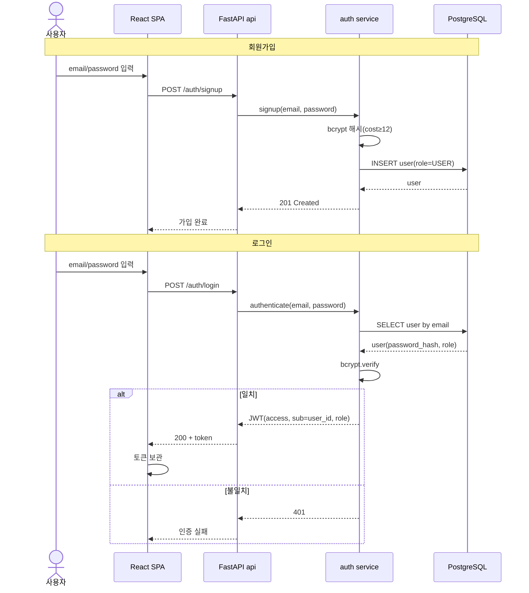

# 시퀀스: 인증 (회원가입 / 로그인)

```mermaid
sequenceDiagram
  actor U as 사용자
  participant SPA as React SPA
  participant API as FastAPI api
  participant SVC as auth service
  participant DB as PostgreSQL

  Note over U,DB: 회원가입
  U->>SPA: email/password 입력
  SPA->>API: POST /auth/signup
  API->>SVC: signup(email, password)
  SVC->>SVC: bcrypt 해시(cost≥12)
  SVC->>DB: INSERT user(role=USER)
  DB-->>SVC: user
  SVC-->>API: 201 Created
  API-->>SPA: 가입 완료

  Note over U,DB: 로그인
  U->>SPA: email/password 입력
  SPA->>API: POST /auth/login
  API->>SVC: authenticate(email, password)
  SVC->>DB: SELECT user by email
  DB-->>SVC: user(password_hash, role)
  SVC->>SVC: bcrypt.verify
  alt 일치
    SVC-->>API: JWT(access, sub=user_id, role)
    API-->>SPA: 200 + token
    SPA->>SPA: 토큰 보관
  else 불일치
    SVC-->>API: 401
    API-->>SPA: 인증 실패
  end
```
