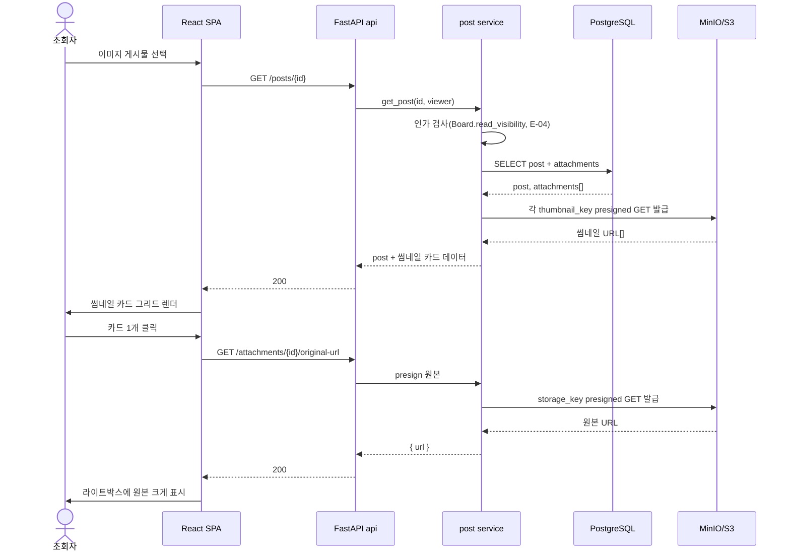

# 시퀀스: 이미지 게시판 조회 (썸네일 그리드 → 라이트박스)

```mermaid
sequenceDiagram
  actor V as 조회자
  participant SPA as React SPA
  participant API as FastAPI api
  participant SVC as post service
  participant DB as PostgreSQL
  participant S3 as MinIO/S3

  V->>SPA: 이미지 게시물 선택
  SPA->>API: GET /posts/{id}
  API->>SVC: get_post(id, viewer)
  SVC->>SVC: 인가 검사(Board.read_visibility, E-04)
  SVC->>DB: SELECT post + attachments
  DB-->>SVC: post, attachments[]
  SVC->>S3: 각 thumbnail_key presigned GET 발급
  S3-->>SVC: 썸네일 URL[]
  SVC-->>API: post + 썸네일 카드 데이터
  API-->>SPA: 200
  SPA->>V: 썸네일 카드 그리드 렌더

  V->>SPA: 카드 1개 클릭
  SPA->>API: GET /attachments/{id}/original-url
  API->>SVC: presign 원본
  SVC->>S3: storage_key presigned GET 발급
  S3-->>SVC: 원본 URL
  SVC-->>API: { url }
  API-->>SPA: 200
  SPA->>V: 라이트박스에 원본 크게 표시
```
