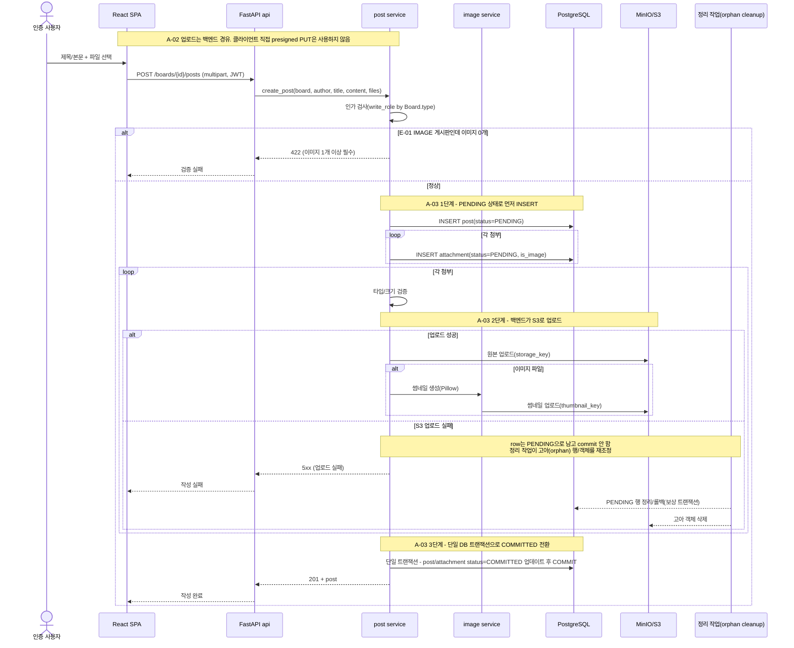

# 시퀀스: 게시물 작성 + 첨부 (일반/이미지 게시판)

```mermaid
sequenceDiagram
  actor U as 인증 사용자
  participant SPA as React SPA
  participant API as FastAPI api
  participant SVC as post service
  participant IMG as image service
  participant DB as PostgreSQL
  participant S3 as MinIO/S3
  participant JOB as 정리 작업(orphan cleanup)

  Note over SPA,SVC: A-02 업로드는 백엔드 경유. 클라이언트 직접 presigned PUT은 사용하지 않음
  U->>SPA: 제목/본문 + 파일 선택
  SPA->>API: POST /boards/{id}/posts (multipart, JWT)
  API->>SVC: create_post(board, author, title, content, files)
  SVC->>SVC: 인가 검사(write_role by Board.type)
  alt E-01 IMAGE 게시판인데 이미지 0개
    SVC-->>API: 422 (이미지 1개 이상 필수)
    API-->>SPA: 검증 실패
  else 정상
    Note over SVC,DB: A-03 1단계 - PENDING 상태로 먼저 INSERT
    SVC->>DB: INSERT post(status=PENDING)
    loop 각 첨부
      SVC->>DB: INSERT attachment(status=PENDING, is_image)
    end
    loop 각 첨부
      SVC->>SVC: 타입/크기 검증
      Note over SVC,S3: A-03 2단계 - 백엔드가 S3로 업로드
      alt 업로드 성공
        SVC->>S3: 원본 업로드(storage_key)
        alt 이미지 파일
          SVC->>IMG: 썸네일 생성(Pillow)
          IMG->>S3: 썸네일 업로드(thumbnail_key)
        end
      else S3 업로드 실패
        Note over SVC,JOB: row는 PENDING으로 남고 commit 안 함<br/>정리 작업이 고아(orphan) 행/객체를 재조정
        SVC-->>API: 5xx (업로드 실패)
        API-->>SPA: 작성 실패
        JOB-->>DB: PENDING 행 정리/롤백(보상 트랜잭션)
        JOB-->>S3: 고아 객체 삭제
      end
    end
    Note over SVC,DB: A-03 3단계 - 단일 DB 트랜잭션으로 COMMITTED 전환
    SVC->>DB: 단일 트랜잭션 - post/attachment status=COMMITTED 업데이트 후 COMMIT
    SVC-->>API: 201 + post
    API-->>SPA: 작성 완료
  end
```
