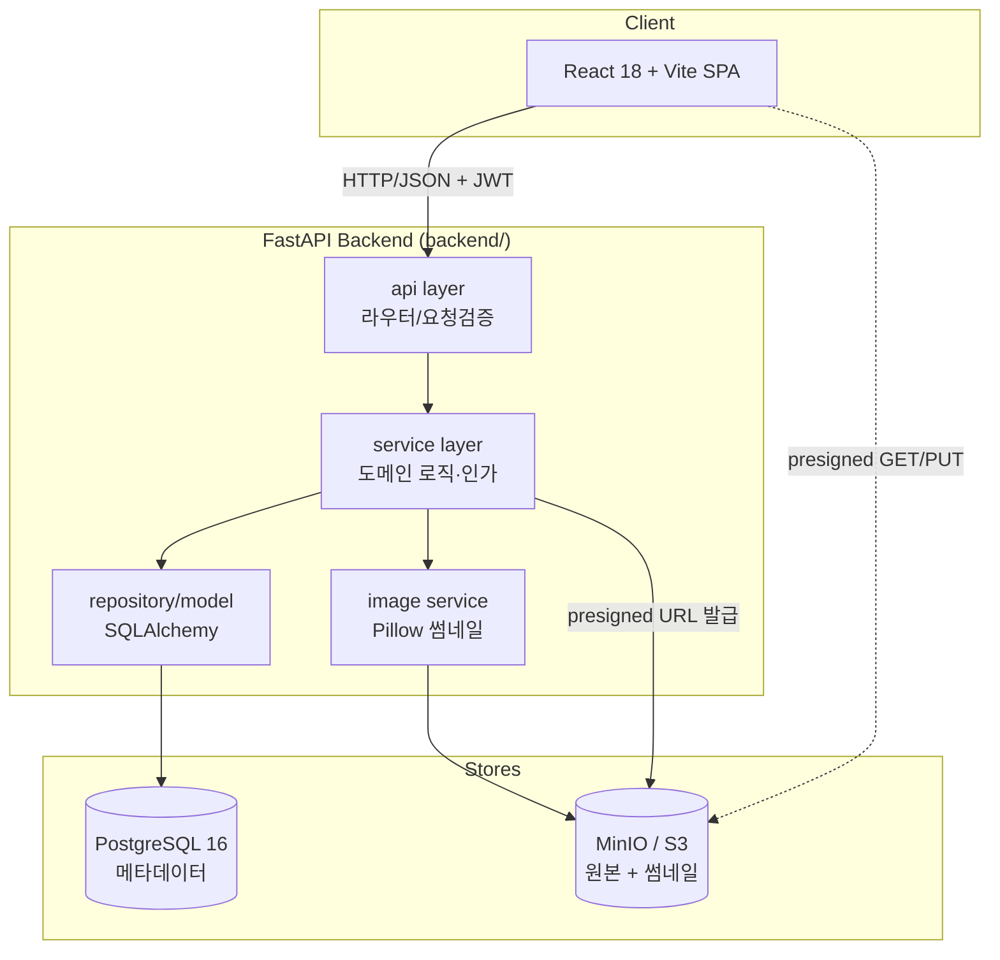

# 시스템 아키텍처 (System Architecture)

게시판 시스템은 React SPA, FastAPI 백엔드, PostgreSQL, MinIO(S3 호환) 오브젝트 스토리지로 구성된 3-tier 구조다.

## 컴포넌트 책임

- **React SPA**: 라우팅, 인증 토큰 보관, 게시판/게시물/이미지 UI(카드 그리드·라이트박스). OpenAPI 생성 클라이언트로 백엔드 소비.
- **api layer**: 라우팅·스키마 검증(pydantic)·인증 의존성 주입. DB 직접 접근 금지.
- **service layer**: 도메인 규칙과 인가(role/소유권/Board.type 분기)의 단일 집행 지점.
- **repository/model**: SQLAlchemy 모델·쿼리. 영속화 캡슐화.
- **image service**: 업로드 이미지 검증 및 Pillow 썸네일 생성, MinIO 키 관리.

## 계약

API 계약은 OpenAPI(SoT=backend). frontend는 생성 타입 클라이언트만 소비(AGENTS.md §5.1).
